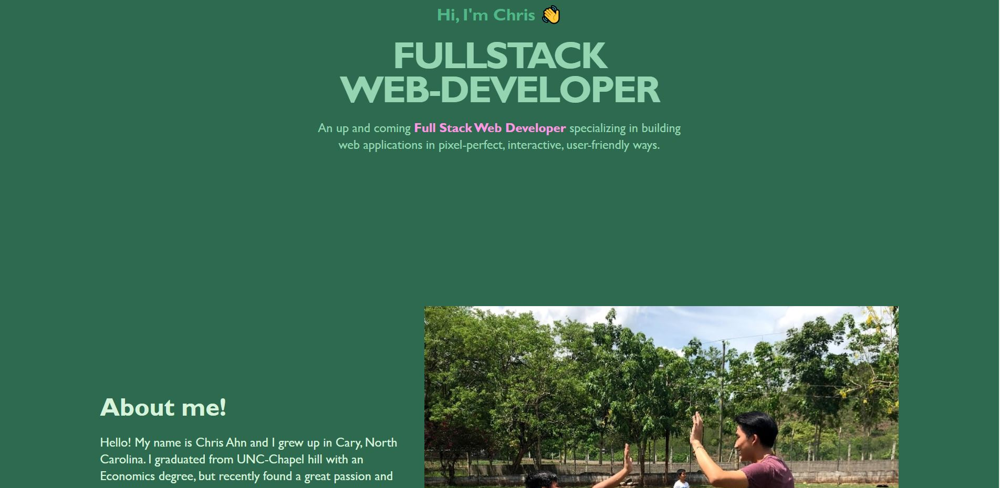

# Chris-s-Amazing-Portfolio
HTML and CSS for a portfolio website on skills and projects

This website showcases my skills in HTML and CSS and includes links to my recent projects.

Used best practices with the HTML code as well as CSS. The page is fully responsive using media queries inside of the CSS file.

Used custom colors to create a color palette for the website and used variable to store those color numbers so that it could be accessed through out the CSS code without being repetitive. 

When the mouse hovers over the images or links, the images zooms in and the links turn white all with a 0.3 transition time. 

URL of deployed App! : https://chrisahn10.github.io/Chris-s-Amazing-Portfolio/